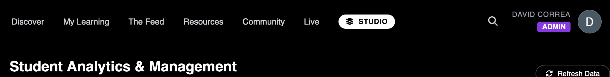
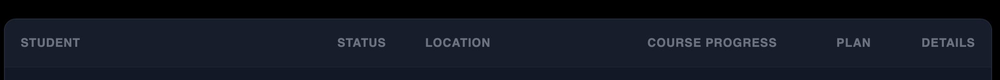

# Label M... | MVP Technical Leadership Showcase 🇬🇷

**Company:** The Factory Music Group - Athens, Greece  
**Duration:** March 2026 - June 2026  
**My Role:** Technical Lead & Fullstack Developer (Internship)  
**Official Scope:** Backend software development, REST API integration, and Technical Leadership for MVP development.

---

## 👋 Introduction

This repository serves as a public showcase of my engineering journey and leadership role during my internship at The Factory Music Group. As the **Technical Lead for the MVP phase**, I am responsible for architecting and building **Label M...**, a cutting-edge music business education platform.

My work bridges the gap between complex backend logic (Firebase, SQL, Python) and intuitive frontend interfaces (React, Vite, Tailwind), ensuring a scalable architecture for the company's first market launch.

*(Note: To honor NDA policies, no source code is shared. This repository documents UI/UX architecture and high-level problem-solving).*

---

## 🚀 Key Achievements & Feature Implementation

### 1. Unified Admin Studio: Data Visibility & UX
**The Problem:** The administration team lacked visibility into key user metadata (location, specific profile details), making it difficult to segment students for the music business programs. Data was scattered across the Firebase Console.
**The Solution:** 
* **Enhanced Data Grid:** Integrated geolocation and custom profile fields into a central Admin Dashboard.
* **Detailed User View:** Developed a dedicated "Client Detail" page to visualize individual progress, subscription status, and personal professional goals.
* **Real-Time Sync:** Leveraged Firebase `onSnapshot` for real-time data binding, ensuring the dashboard reflects changes instantly without page reloads.

### 2. Google Auth Onboarding & Data Integrity
**The Problem:** Inconsistent data capture during Google Social Login led to incomplete user records ("ghost documents") missing essential fields like `uid`, `email`, and `joinedAt`.
**The Fix:** Engineered a robust `handleSubmit` logic with `{merge: true}` in Firestore `setDoc` calls. This ensures that during the first login, all mandatory metadata is validated and persisted without accidental data loss.

### 3. Advanced UI/UX Refactor: Onboarding Quiz
**The Problem:** Generic styling and mobile rendering bugs (typography clipping) in the main lead-capture tool, which affected user conversion rates.
**The Solution:** Implemented a high-fidelity "Cinematic Neon" UI using CSS Specificity and WebKit Masking, optimizing the flow for conversion on high-end mobile devices.

### 4. Community Hub: Social Engine & Modular Architecture

**The Problem:** The initial community interface was a static, monolithic list that didn't allow for user interaction or content categorization, limiting student engagement.
The Solution:

**Architectural Decoupling:** Refactored the entire community module into a feature-based page system, separating business logic from UI components (PostCreator, PostCard).

**Interactive UX:** Implemented a real-time "Optimistic UI" pattern for social interactions (likes, filtering) and a multi-category navigation system.

**Gamification Integration:** Integrated "Mastery Cards" and "Leaderboards" into the layout to increase user retention and course completion rates.

---

## 🏗️ Technical Milestones & Architecture Case Studies

| Milestone | Key Technologies | Documentation |
| :--- | :--- | :--- |
| **Real-Time Social Engine** | React, Firebase, Data Normalization | [View Case Study](./milestones/real-time-social-engine/README.md) |
| **Community Hub Architecture** | React, TypeScript, Glassmorphism, Social UX | [View Case Study](./milestones/community-hub-architecture/README.md) |
| **Advanced UI/UX Quiz Refactor** | CSS Specificity, WebKit Masking, Responsive Design | [View Case Study](./milestones/quiz-ui-refactor/README.md) |
| **Admin Data Architecture** | Firebase Firestore, NoSQL Schema, TypeScript | [View Case Study](./milestones/admin-data-architecture/README.md) |
| **Onboarding Quiz & Select2 Refactor** | CSS Wildcards, Flexbox, UI Synchronization | [View Case Study](./milestones/onboarding-quiz-neon-refactor/README.md) |

---

## 📩 Contact Me

* **GitHub:** [dalva-code](https://github.com/dalva-code)
* **LinkedIn:** [David Esteban Correa Alvarado](https://www.linkedin.com/in/david-esteban-correa-alvarado-5140a1232/)
