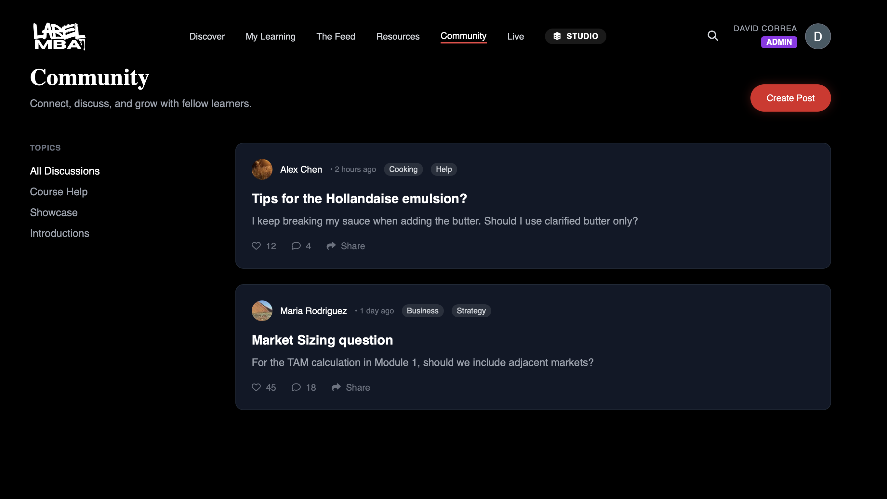
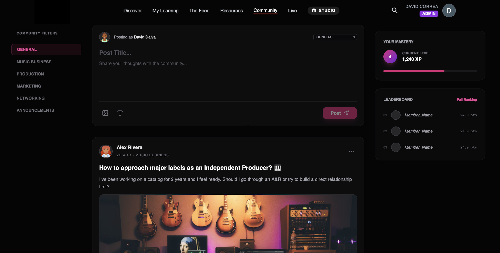

# Case Study: Interactive Community Hub & Social Architecture

## 🎯 The Challenge
Building a high-engagement social space within an educational platform. The goal was to move away from a basic message list to a full-featured "Social Feed" that felt native to the music industry's premium aesthetic.

## 🏗️ Architectural Approach: "Feature-First"
To ensure scalability, I moved all community logic out of the root `App.tsx` and implemented a modular structure:
- **Container Component (`CommunityPage.tsx`):** Manages the global state of the feed, filtering logic, and data orchestration.
- **Atomic Components:** 
    - `PostCreator`: A stateful form with real-time validation.
    - `PostCard`: A memoized component optimized for rendering media and engagement metrics.
- **Layout Engine (`CommunityLayout.tsx`):** A custom tri-column grid system designed for high-resolution displays.

## 🎨 UI/UX Design System
- **Aesthetic:** High-fidelity "Dark Glassmorphism" using Tailwind CSS.
- **Feedback Loops:** Implementation of "Optimistic UI" updates—when a user likes a post, the UI updates in <100ms, providing a zero-latency experience before the server confirms the action.
- **Responsiveness:** Fluid typography and flexible containers to ensure the dashboard remains functional from mobile to ultra-wide monitors.

## 📸 Visual Evolution

| Before (Static Feed) | After (Interactive Hub) |
| :---: | :---: |
|  |  |