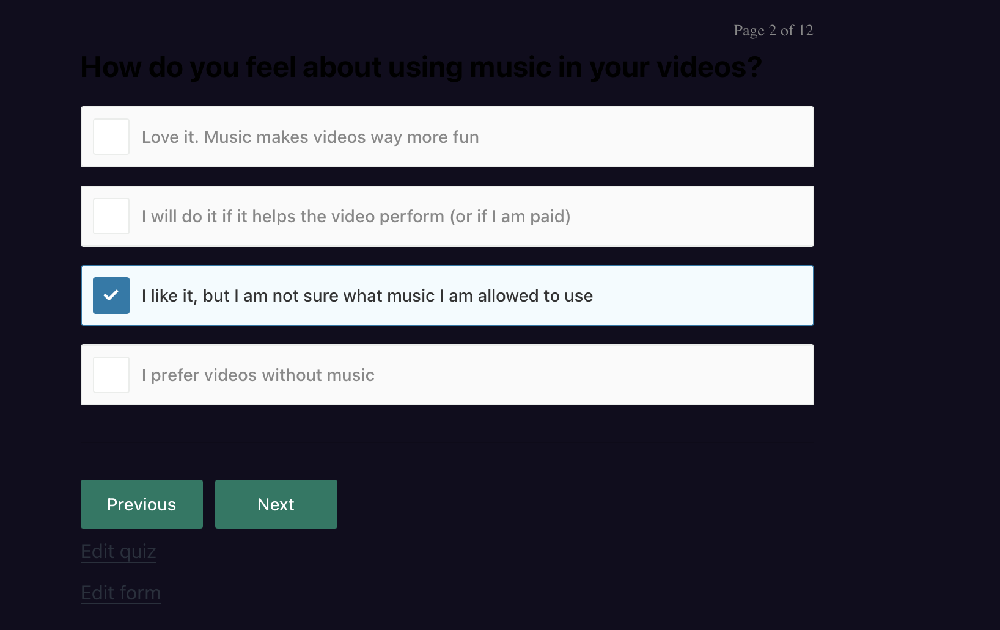
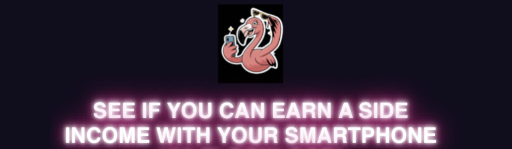
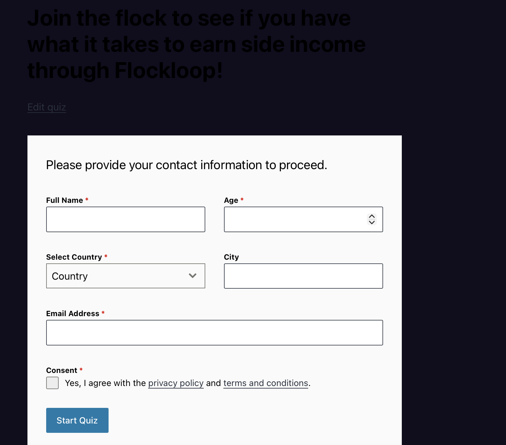
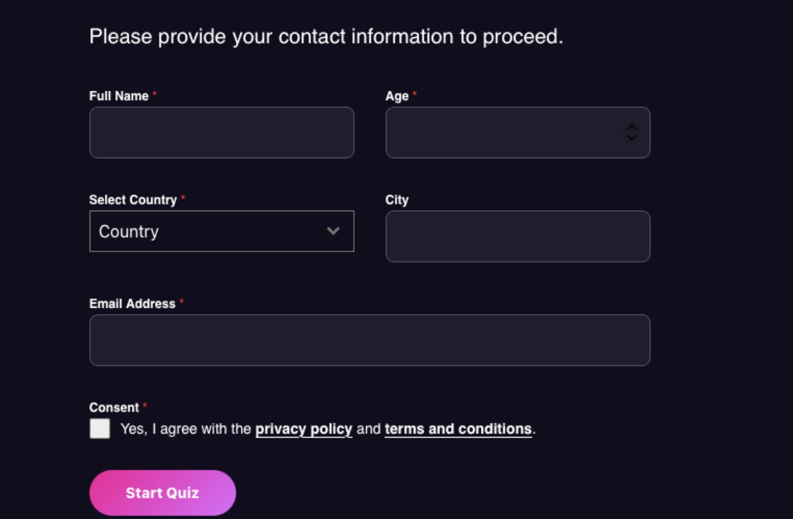

# Case Study: High-Fidelity UI/UX Quiz Refactor 🚀

## 📋 Overview
In this milestone, I led the visual transformation of the lead-capture quiz for **Label M...**. The goal was to convert a standard, generic third-party form into a high-end "Cinematic Neon" experience aligned with the music industry brand.

## 🛠️ The Technical Challenge
The third-party library used for the quiz injected elements into the DOM with **Dynamic IDs** (e.g., `select2-forminator-69c536...`). This rendered traditional static CSS selectors useless. 

### Key Problems:
1. **Selector Volatility:** IDs changed on every page refresh.
2. **Style Bleeding:** Default plugin styles (blue outlines, white backgrounds) clashed with the Dark Mode requirements.
3. **Asset Masking:** Integrating a non-transparent brand GIF (The Flamingo) without creating a "boxy" visual artifact.

## 💡 The Solution

### 1. Dynamic Attribute Targeting
Instead of targeting IDs, I used **CSS Attribute Selectors** with wildcards to hook into the persistent parts of the dynamic strings:
```css
/* Target any span whose ID contains the Forminator container string */
span[id*="select2-forminator"] {
    color: #ffffff !important;
}

2. Visual Layering (Glassmorphism)
To create depth, I implemented a layering system using rgba transparencies and backdrop-filter. This ensured text legibility while maintaining the "Neon" aesthetic.

3. State-Based UI Orchestration
I used CSS combinators to detect the "active" state of the quiz steps and toggle the visibility of global headers:

/* Hide title only when the quiz module is active/visible */
#quiz-module:not([style*="display: none"]) ~ .global-header {
    display: none;
}
📈 Results
Brand Consistency: 100% alignment with the company's "Cyberpunk" visual identity.

UX Friction Reduction: Improved mobile readability and button hierarchy (Primary vs. Ghost buttons).

Architecture: Zero modification of the third-party core code, ensuring update compatibility.


## 📸 Visual Comparison

| Before (Generic Library UI) | After (Custom Neon UI) |
| :---: | :---: |
|  |  |
|  |  |