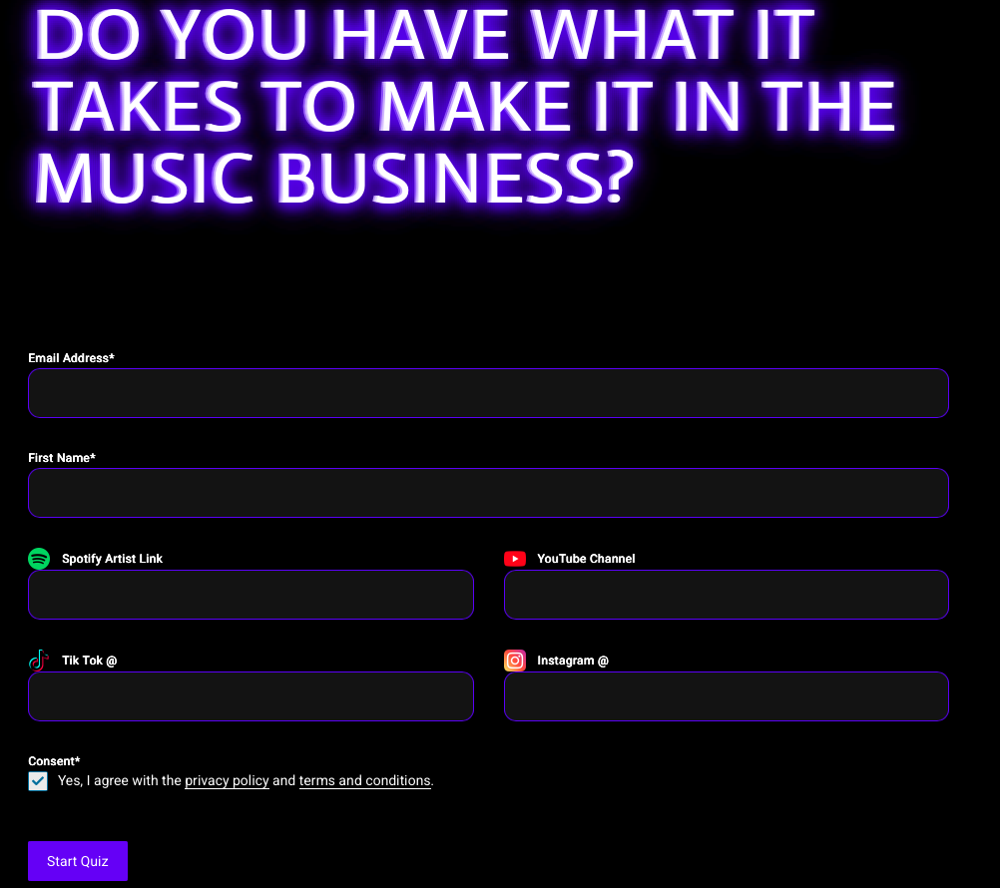

# Case Study: Advanced UI/UX Refactor for Lead Capture Quiz

## 📌 Context
The "Label MBA" onboarding funnel relies on a complex quiz. The original 3rd-party implementation had generic styling, broken visibility for legal texts in Dark Mode, and typographic clipping issues.

## 🛠️ Technical Challenges & Solutions

### 1. CSS Specificity & Injection
- **Problem:** Plugin styles were overriding brand colors.
- **Solution:** Used scoped CSS with `[data-brz-custom-id]` to force high-specificity overrides without global pollution.

### 2. High-Impact Typography (The Clipping Bug)
- **Problem:** 72px titles with `background-clip: text` were getting cut off by the browser engine.
- **Solution:** Switched box-model to `content-box` and added 45px of lateral padding to provide a "rendering buffer" for the neon glow.

### 3. Responsive Scaling
- **Logic:** Implemented Media Queries to scale typography from 72px (Desktop) to 38px (Mobile) for visual balance.

## 📸 Visual Evolution

### Before Refactor
| Step 1 | Step 2 | Step 3 |
| :---: | :---: | :---: |
|  |  |  |

### After Refactor (Label MBA Branding)
| Final Hero | Answer Selection | Consent View |
| :---: | :---: | :---: |
|  |  |  |